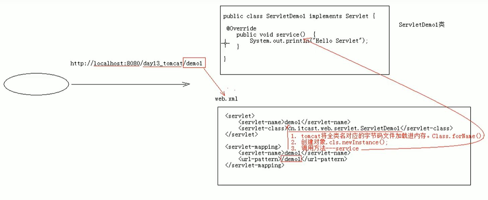
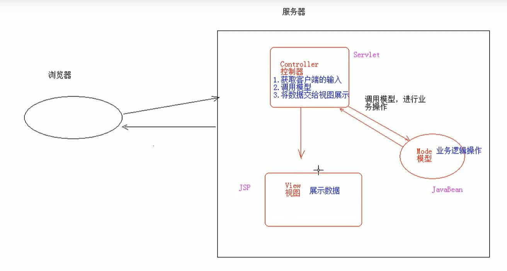

#JavaWeb笔记

###Servlet
* Servlet执行原理
  1. 当服务器接收到客户端浏览器的请求后, 会解析url路径, 获取访问的Servlet的资源路径
  2. 查找web.xml, 是否有对应的 <url-pattern> 标签体内容
  3. 如果有, 则找到对应的 <servlet-class> 全类名
  4. tomcat会将字节码文件加载进内存, 并且创建其对象, 调用方法
  
     
* Servlet生命周期
  1. 被创建: 执行init方法, 只执行一次
     + 说明Servlet在内存中只存在一个对象, Servlet是单例的, 多个用户访问时,可能存在线程安全问题, 所以尽量不要再Servlet中定义成员变量, 
       即使定义了成员变量, 也不要对其赋值 
     + 默认情况下, 当Servlet第一次被访问时创建
     + 也可以在web.xml指定Servlet的创建时机
    ```xml
        <!--指定Servlet的创建时间
            1.第一被访问时创建, load-on-startup配置的值为负数, 默认也是-1
            2.在服务器启动时创建, load-on-startup配置的值为0或正数
        -->
        <load-on-startup>-1</load-on-startup>
    ```
  2. 提供服务: 执行Servlet方法, 执行多次
  3. 被销毁: 执行destroy方法, 只执行一次 (只有服务器正常关闭时, 才会执行destroy方法, destroy方法在Servlet被销毁之前执行, 一般用于释放资源)
  
* Servlet3.0及以上支持注解配置, 不需要用web.xml了

```java
import javax.servlet.annotation.WebServlet;

@WebServlet(urlPatterns = "/myServlet")  // 也可以 @WebServlet(value = "/myServlet") 或者 @WebServlet("/myServlet")
public class MyServlet implements Servlet {
    //......
}

//一个Servlet可以配置多个访问路径
//@WebServlet({"/myServlet1","/myServlet2",""/myServlet3""})

//路径的定义规则
// 1. /xxx
// 2. /xxxxx/xxxxx (多层路径)
// 3. *.do ( *.后缀 不能加斜杠)
```
###HTTP
* 特点
  1. 是基于TCP/IP的高级协议
  2. 默认端口号是80
  3. 基于请求/相应模型的: 一次请求对应一次响应
  4. 无状态的: 每次请求之间相互独立, 不能交互数据
    
* 历史版本
  1. **1.0版本**:每一次请求和响应都会建立新的连接
  2. **1.1版本**:复用连接
  
  
* 请求消息数据格式
  1. 请求行
     + 格式: 请求方式 请求url 请求协议/版本 
     + HTTP协议有7种请求方式, 常用的有两种
       - GET: 请求参数在请求行中, 在url后
       - POST: 请求参数在请求体中
  2. 请求头 (包含客户端浏览器告诉服务器的)一些信息
     + 格式: 请求头的名称: 请求头值
       - 常见的请求头
         1. User-Agent: 浏览器告诉服务器, 客户端访问服务器时, 使用的浏览器的版本信息 (可以用于服务器端获取该头信息,解决浏览器兼容性问题)
         2. Referer: 告诉服务器, 当前请求从哪里来 (可以用于统计或防盗链)
  3. 请求空行
     + 就是一个空行, 用于分隔POST请求的请求头和请求体的
  4. 请求体 (封装POST请求消息的请求参数)

    
* 响应数据格式消息
  1. 响应行
     + 格式: 协议/版本 响应状态码 状态码描述
     + 响应状态码: 
       1. 1xx: 服务器接收客户端消息, 但没有接收完成, 等待一段时间后, 发送1xx状态码
       2. 2xx: 成功
       3. 3xx: (302)重定向, (304)访问缓存
       4. 4xx: 客户端错误 (404)请求路径没有对应的资源  (405)请求方式没有对应的方法
       5. 5xx: 服务器端错误  (500)服务器内部出现异常
  2. 响应头
    + 格式: 响应头的名称: 响应头值
      - 常见的响应头
        1. Content-Type: 服务器告诉客户端本次响应体数据格式以及编码格式
        2. Content-disposition: 服务器告诉客户端以什么格式打开响应体数据
           * in-line: 默认值, 在当前页面打开
           * attachment; file-name=xxx: 以附件形式打开响应体, 常用于文件下载
  3. 响应空行
  4. 响应体


###Request

* request对象和response对象的原理
  1. request/response对象是由服务器创建的, 我们来使用它们
  2. request对象是来获取请求消息, response对象是来设置响应消息
 
* 获取请求行数据
  - URL & URI
    + URL: 统一资源定位符
    + URI: 统一资源标识符
    
* 获取请求头数据

* 获取请求体数据 (只有POST方式才有请求体)
  1. 获取流对象
  2. 从流对象中拿数据
  
* 其他功能
  + 获取请求参数的通用方式
  + 请求转发(一种在服务器内部的资源跳转方式)
    ```java
      req.getRequestDispatcher("/hello").forward(req,resp);
    
      //请求转发的特点
      //1.浏览器地址栏路径没有发生变化
      //2.只能转发到当前服务器的内部资源中
      //3.转发是一次请求  可以使用request对象来共享数据
    ```
  + 共享数据
    - 域对象: 一个有作用范围的对象, 可以在范围内共享数据
    - request域: 代表一次请求的范围, 一般用于请求转发的多个资源中共享数据
  + 获取ServletContext
  
* Tips:
  + 中文乱码问题
    - tomcat8之后, get方式不会出现乱码, tomcat帮我们解决了
    - post方式: 设置流的编码和页面一致
  ```html
  <meta charset="UTF-8">
  ```
  ```java
    //设置流的编码
    req.setCharacterEncoding("utf-8");
  ```
  ```java
    //获取流对象之前设置流的默认编码
    //resp.setCharacterEncoding("utf-8"); //这一步可以省略
    
    //告诉浏览器, 服务器发送的消息体数据数据的编码, 建议浏览器使用该编码解码
    resp.setContentType("text/html;charset=utf-8");
  ```  

  + 路径怎么写
    1. 判断定义的路径是给谁用的? 或者说判断请求是从哪发出的?
    2. 如果是浏览器发出的(给浏览器用的), 那就需要加虚拟目录, 如重定向
    3. 如果是服务器发出的, 那就不需要加虚拟目录, 如转发
  ```java
    //动态获取虚拟目录  
    String contextPath = req.getContextPath();
  ```

###Response
* 设置响应消息
  1. 设置响应行
     + 设置状态码
  2. 设置响应头
  3. 设置响应体
     + 获取输出流
     + 使用输出流, 将数据输出到客户端浏览器中
  
* 重定向
```java
        //1.设置状态码
        //resp.setStatus(302);

        //2.设置响应头location
        //resp.setHeader("location", "/ServletStudy/success.html");

        //有一种简单的重定向方法
        resp.sendRedirect("/ServletStudy/success.html");

        //重定向的特点 
        //1.地址栏发生变化
        //2.重定向可以访问其他站点的资源
        //3.重定向是两次请求 不能使用request对象来共享数据
```
###ServletContext对象 
* 概述: 代表整个Web应用, 可以和程序的容器(服务器)来通信
* 功能: 
  1. 获取MIME类型: 在互联网通信过程中定义的一种文件数据类型
     + 格式: 大类型/小类型  如 text/html  image/jpeg
  2. 域对象:
     + ServletContext对象范围: 所有用户所有请求的数据
  3. 获取文件的真实路径(在服务器的位置)

###会话技术
* 会话: 一次会话中包含多次请求和响应
  + 一次会话: 浏览器第一次给服务器资源发送请求, 会话建立, 直到有一方断开位置
    
* 功能: 在一次会话的范围内的多次请求间, 共享数据

* 方式:
  + 客户端会话技术: Cookie
  + 服务器端会话技术: Session

###Cookie
* 概述: 客户端的会话技术, 将数据保存到客户端
* 使用:
  1. 创建Cookie对象, 绑定数据
  2. 发送Cookie对象
  3. 获取Cookie, 拿数据
  
* 实现原理(基于响应头set-cookie和请求头cookie实现的)

  
* 关于Cookie的几个问题
  1. 一次可以发送多个cookie吗?  ----> 可以创建多个Cookie对象, 使用response调用多次addCookie方法, 发送Cookie即可
  2. Cookie在浏览器中可以存多久? ----> 
     + 默认情况下, 当浏览器关闭后, Cookie数据被销毁
     + 设置Cookie的生命周期, 持久化存储
  3. Cookie能不能存中文?  ----->  
     + 在Tomcat8之前, Cookie不能直接存储中文数据, 需要转码, 一般采用URL编码
     + 在Tomcat8之后, Cookie支持中文数据
  4. Cookie的获取范围
     + 默认情况下, cookie不能共享(假设在一个tomcat里部署了多个web项目, 在这些web项目之间, cookie不能共享)
     + 如果部署在同一个tomcat的web项目要共享cookie, 可以使用setPath方法设置共享范围为 "/"
     + 不同的Tomcat服务器间cookie如何共享: 需要设置 setDomain , 如果设置一级域名相同, 那么多个服务器之间cookie可以共享
       - 如: setDomain(".baidu.com"), 则tieba.baidu.com和news.baidu.com中cookie可以共享
    
* Cookie的特点
  1. cookie存储数据在客户端浏览器
  2. 浏览器对于单个cookie的大小有限制(4kb), 以及对于同一域名下的总cookie数量也有限制(20个)
    
* Cookie的作用
  1. cookie一般用于存储少量的不太敏感的数据
  2. 在不登陆的情况下, 完成服务器对客户端的身份识别

###JSP
* 本质: JSP的本质是Servlet
* JSP脚本
  + <% 代码 %>: 定义的java代码会出现在service方法中, service方法可以定义什么, 这里就能写什么
  + <%! 代码 %>: 定义的java代码, 会出现在jsp转换后的java类的成员位置, 比较少用
  + <% 代码 %>: 定义的java代码, 会输出到页面上, 输出语句中定义什么, 该脚本就可以定义什么
  
* JSP指令
  + 作用: 用于配置jsp页面, 导入资源文件
  + 格式: <%@ 指令名称 属性名1=属性值1 属性名2=属性值2 ...%>
  + 分类: 
    - page: 配置jsp页面
    - include: 页面包含的文件和导入页面的资源文件  <%@include file="logo.jsp""%>
    - taglib: 导入资源  <%@taglib prefix="c" uri="http://java.sun.com/jsp/jstl/core" %>
  
* JSP的内置对象(在jsp页面中不需要获取和创建, 可以直接使用的对象, 一共9个)
  1. request: 域对象, 共享数据范围: 一次请求访问的多个资源(转发)
  2. response: 响应对象
  3. out: 字符输出流对象, 可以将数据输出到页面上 **response.getWriter()输出的数据永远在out之前**
  4. pageContext: 域对象, 当前页面共享数据, 还可以用来获取其他8个内置对象
  5. session: 域对象, 共享数据范围: 一次会话的多个请求间
  6. application: 域对象, 类型是ServletContext, 共享数据的范围: 所有用户间
  7. page: 当前页面(servlet)的对象 this
  8. config: Servlet的配置对象
  9. exception: 只有在page指令中声明 isErrorPage="true" 时, 才可以使用

###Session
* 概述: 服务器端会话技术, 在一次会话的多次请求间共享数据, 将数据保存在服务器端的HttpSession对象中
* 原理: Session的实现是依赖于Cookie的

  
* 关于Session的几个问题
  1. 当客户端关闭后, 服务器不关闭, 两次获取的session是不是同一个?
     + 默认情况下不是
     + 如果需要相同, 则可以创建Cookie, 设置键为JSESSIONID, 设置最大存活时间, 让cookie持久化保存
     + ```java
        Cookie c = new Cookie("JSESSIONID", session.getId());
        c.setMaxAge(60*60);
        resp.addCookie(c);
       ```
     
  2. 当客户端不关闭, 服务器关闭后, 两次获取的session是不是同一个?
     + 不是同一个, 但是要确保数据不丢失
     + session的钝化: 在服务器正常关闭之前, 将session对象序列化到硬盘上
     + session的活化: 在服务器启动后, 将session文件转化为内存中的session对象即可
  3. session什么时候被销毁?
     + 服务器关闭
     + session对象调用session.invalidate()方法
     + session的默认失效时间: 30min
    ```xml
     <session-config>
        <session-timeout>30</session-timeout>
    </session-config>
   ```

* Session的特点
  1. session用于存储一次会话的多次请求的数据, 存在服务器端
  2. session可以存储任意类型, 任意大小的数据

* Session与Cookie的区别
  1. session存储数据在服务器端, Cookie在客户端
  2. session没有数据大小限制, cookie有
  3. session数据安全, cookie相对不安全

###MVC


###三层架构


###Filter 过滤器

* Web中的过滤器: 当访问服务器的资源时, 过滤器可以将请求拦截下来, 完成一些特殊功能
* 过滤器的作用: 一般用于完成通用的操作, 如: 登录验证, 统一编码处理
* 过滤器的执行流程:
  1. 执行过滤器
  2. 执行放行后的资源
  3. 回归过滤器, 执行过滤器放行之后下面的代码
    
* 过滤器配置
  1. 拦截路径配置
     + 具体资源路径拦截: /index.jsp  只有访问index.jsp资源时, 过滤器才会被执行
     + 目录拦截: /user/*  访问/user 下的所有资源时, 过滤器都会被执行
     + 后缀名拦截: *.jsp  访问所有jsp资源时, 过滤器会被执行
     + 拦截所有资源: /* 
  
  2. 拦截方式配置: 资源被访问的方式
     + 注解配置(设置dispatcherTypes属性)
       1. REQUEST: 默认值, 浏览器直接请求资源
       2. FORWARD: 转发访问资源
       3. INCLUDE: 包含访问资源
       4. ERROR: 错误跳转资源
       5. ASYNC: 异步访问资源
    + web.xml配置
    ```xml
     <dispatcher>REQUEST</dispatcher>  
    ```
* 过滤器链配置(配置多个过滤器)
  + 执行顺序(以2个过滤器为例, f1, f2)
    1. f1先执行
    2. f2后执行
    3. 资源执行
    4. 回归f2, 执行下面代码
    5. 回归f1, 执行下面代码
  + 过滤器先后顺序问题
    1. 注解配置(按照类名的字符串比较规则, 值小的先执行)
    2. web.xml配置(哪个filter的<filter-mapping>配置在前就先执行)
    
###代理模式(一种设计模式)
* 概念:
  + 真实对象: 被代理的对象
  + 代理对象:
  + 代理模式: 代理对象代理真实对象, 达到增强真实对象功能的目的
    
* 实现方式
  + 静态代理: 定义一个类文件描述代理模式
  + 动态代理: 在内存中形成代理类

###Listener 监听器
* 概念: 
  + 事件监听机制: 事件, 事件源, 监听器, 注册监听
    
###AJAX (Asynchronous JavaScript And XML)
* 概念:
  1. 异步和同步: 
    
     
  2. 实现
     + 原生JavaScript实现
     + JQuery实现
    ```java
       
       //使用$.ajax()发送异步请求
       $.ajax({
            url: "ajaxServlet"; //请求路径
            type: "POST"; // 请求方式
            data: {"username:jack", "age":23}, //请求参数
            success: function(data) {
                alert(date);
            }, //响应成功后的回调函数
            error: function() {
                alert("出错啦...")
            },  //如果请求响应出现错误, 会执行的回调函数
            dataType: "text" //设置接收到的响应数据的格式
       });
  
       //使用$.get()发送异步请求 请求路径 请求参数 回调函数 响应结果的类型
       $.get("ajaxServlet", {username:"tom"}, function(data) {
            alert(date);
       }, "text");
  
       //使用$.post()发送异步请求
       $.post("ajaxServlet", {username:"tom"}, function(data) {
            alert(date);
       }, "text");
    ```